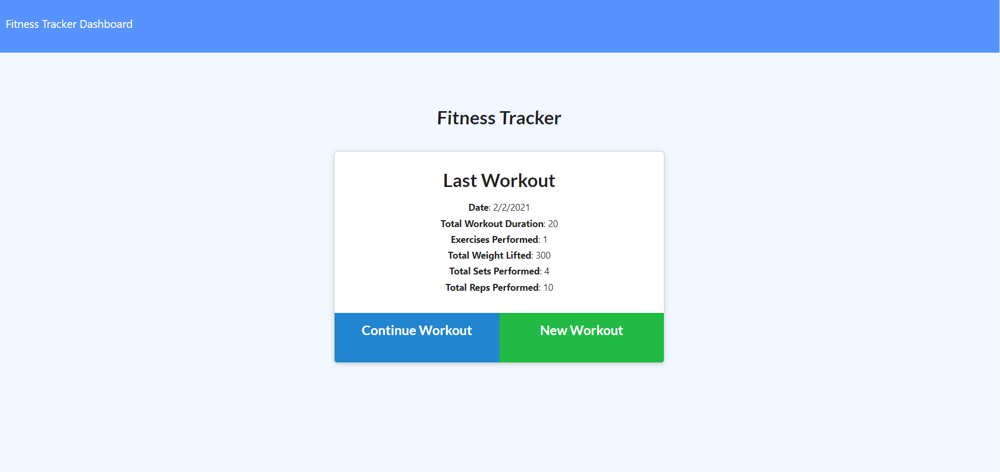
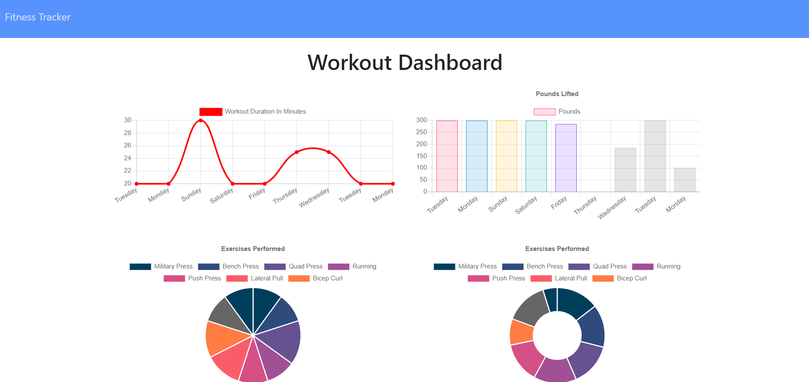

#  **Fitness_Tracker**

  

  ## Application Description:
  > *This application allows a user to tack their workouts and fitness progress. With this application, a user can also add exercises to the most recent workout plan, add new exercises to a new workout plan, view the combined weight of multiple exercises from the past seven workouts on the `stats` page, and view the total duration of each workout from the past seven workouts on the `stats` page.*

  Below is a picture of the Application:
  
  
  
  ## Table of Contents:

  * [Project Description](#description)
  * [Installation Process](#installation)
  * [Usage](#usage)
  * [How to Contribute](#contribution)
  * [License](#license)
  * [Questions](#questions)
  * [Creator Information](#creator)

  ## Installation:
  > *To properly install, run 'npm i' in the terminal to download the necessary dependencies.*

  ## Usage:
  > *In order to use this repo and application, you will need to download the dependencies, and then run 'npm run seed' in the terminal. Once you've done that, you can run 'node server.js' to kick off the application. The terminal will display what local host port is app is using.*

  ## Contribution:
  > *Contributions are welcome! Please ensure that you are editing in branches and submit pull requests with your adjustments.*

  ## License:
  > *Apache 2.0*

  ## Questions:
  If you have questions, please reach out using the following link
  >[GitHub Profile](http://github.com/Seth-hulsmeyer)

  ## Creator:
  * **Name:** Seth Hulsmeyer
  * **GitHub Username:** Seth-hulsmeyer
  * **Email:** seth.hulsmeyer@hotmail.com